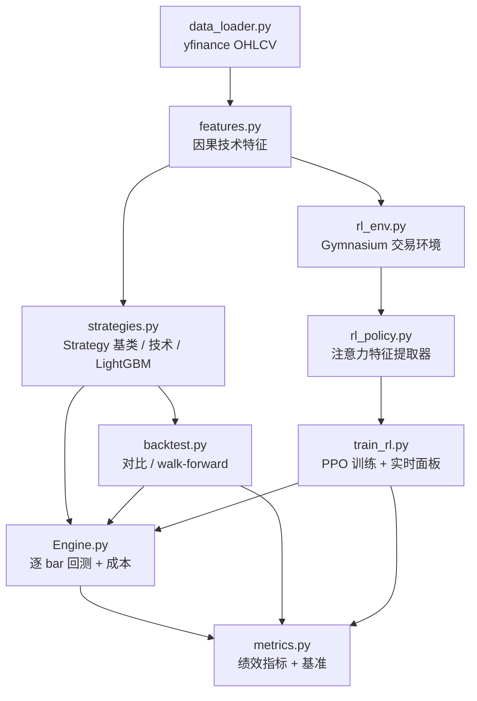

# 技术简报：日线策略回测与强化学习交易智能体

> 配套代码见仓库根目录；使用说明见 [README.md](README.md)。

## 1. 摘要

本项目构建了一套面向单资产的日线策略研究与回测系统，核心目标有三：

1. **真实**：以逐 bar 的现金/持仓模拟替代简化的向量化收益累乘，完整建模手续费、最低佣金、滑点、印花税与融券利息。
2. **可验证**：所有策略共用统一的信号接口与无未来函数的执行时序，并提供滚动 walk-forward 样本外验证。
3. **可扩展**：策略层可插拔，已从技术指标策略扩展到监督学习（LightGBM）与强化学习（PPO + 注意力网络）。

在 2010–2026 的上证指数（`000001.SS`）上，一系列朴素策略与机器学习基线**均未跑赢买入持有**。诊断表明，主要失败模式是**换手成本**而非信号方向：LightGBM 的毛收益为 +7%，但 82.5% 的日均换手率在含成本后把结果拖到 -73.5%。这一发现直接驱动了后续强化学习中「连续仓位 + 换手惩罚 + 差分 Sharpe 奖励」的设计。

## 2. 系统架构

### 2.1 模块与数据流



### 2.2 核心设计原则

- **信号与执行分离**：策略只输出目标仓位 `signal`，执行、T+1、成本全部由引擎负责。
- **口径统一**：RL 环境与回测引擎共用同一套成本参数和 T+1 语义，训练目标与评估口径一致。
- **因果性**：所有特征只使用截至当前 bar 的信息，标签为下一 bar 的方向，杜绝未来函数。

## 3. 数据与特征

### 3.1 数据

- 数据源：`yfinance`，自动处理 MultiIndex 列。
- 研究对象：`000001.SS`（上证指数），区间 2010-01-01 ~ 2026-08-31，共约 4040 个交易日。
- 切分（RL）：训练 2010–2019（2426 bar），样本外测试 2020–2026（1615 bar）。

### 3.2 特征（`features.py`）

| 类别 | 特征 |
|---|---|
| 动量 | `ret_1/2/3/5/10/20`（多周期收益率） |
| 波动 | `vol_5`、`vol_20`（滚动标准差） |
| 趋势 | `sma_10/50/200`（价格对均线的相对偏离） |
| 超买超卖 | `rsi_14`（归一化到 [0,1]） |
| 趋势强度 | `macd_line`、`macd_hist`（除以价格归一化） |
| 通道位置 | `bb_pos`（价格在布林带中的相对位置）、`bb_width` |
| 量能 | `vol_change`（5 日成交量变化） |

RL 环境使用其中 10 维（`FEATURE_COLS`），并取最近 `window=20` 天构成序列输入。

## 4. 回测引擎方法论

### 4.1 执行时序（T+1，无未来函数）

- `signal_t`：在 `t` 日收盘、仅用截至 `t` 日信息决定的目标仓位。
- 引擎在 `t` 日收盘按 `signal_t` 调仓，持仓从 `t+1` 日起产生盈亏。
- 因此 `position_{t+1} = signal_t`，`t+1` 日收益为 `position_{t+1} · r_{t+1}`，其中 `r_{t+1} = close_{t+1}/close_t − 1`。

### 4.2 现金/持仓模拟（`Engine.py`）

引擎逐 bar 维护 `cash` 与 `shares`，伪代码：

```
for each bar t:
    equity_pre = cash + shares * price_t          # 调仓前权益
    if signal_t != prev_signal:                    # 仅信号变化时交易
        desired_shares = signal_t * equity_pre / price_t
        delta = desired_shares - shares
        notional = |delta| * price_t
        commission = max(notional * commission_rate, min_commission)
        slippage   = notional * slippage_rate
        stamp      = |delta| * price_t * stamp_tax   (仅当 delta < 0，卖出)
        cash -= delta * price_t + commission + slippage + stamp
        shares += delta
    if shares < 0:                                 # 空头融券利息，按日计提
        cash -= |shares| * price_t * short_borrow_fee / 252
    equity_t = cash + shares * price_t
```

### 4.3 成本模型

| 成本 | 默认值 | 计费方式 |
|---|---|---|
| 佣金 `commission` | 2.5 bp | 双边，按成交额，含 `min_commission=5` 下限 |
| 滑点 `slippage` | 5 bp | 双边，按成交额 |
| 印花税 `stamp_tax` | 5 bp | 仅卖出 |
| 融券利息 `short_borrow_fee` | 2% / 年 | 对空头市值按日计提 |

单次满仓多→空翻转（换手 200%）的成本约为权益的 `2×0.25% + 2×0.5% + 2×0.5% ≈ 0.25%`。

### 4.4 关键修正：仅在信号变化时交易

初版引擎每天按目标权重**再平衡**，导致价格漂移后持续微调仓位，产生隐性成本——Buy & Hold 回测收益 -6.95%，而实际应为 +20.41%。修正为「仅当 `signal` 变化才交易」后，Buy & Hold 精确复现基准（+20.43% vs +20.41%），验证了引擎正确性。

## 5. 策略体系

### 5.1 技术策略

| 策略 | 信号逻辑 |
|---|---|
| `BuyAndHoldStrategy` | 恒定 +1，作为基准 |
| `SmaCrossStrategy` | 短均线 > 长均线 → 多，否则空/平 |
| `MacdStrategy` | MACD 线上穿信号线 → 多，否则空/平 |
| `MomentumStrategy` | 过去 N 日收益 > 0 → 多，否则空/平 |
| `BollingerMeanReversionStrategy` | 跌破下轨 → 多，突破上轨 → 空，带内空仓 |
| `RsiMeanReversionStrategy` | RSI < 30 → 多，RSI > 70 → 空，其余空仓 |

### 5.2 监督学习策略（LightGBM）

- 特征：`compute_features` 全量技术特征；标签：次日涨跌方向（二分类）。
- 训练集：`index <= train_end`；测试集：之后，二者不重叠，特征均为因果特征。
- 输出：`predict_proba > 0.5` → 多，否则空。
- 样本外验证：`walk_forward` 使用扩张窗口滚动重训，仅拼接样本外预测段评估。

### 5.3 强化学习策略（PPO）

见第 6 节。

## 6. 强化学习设计

### 6.1 MDP 定义（`rl_env.py`）

- **状态 `s_t`**：截至 `t` 日的 `window=20` 天 × 10 维特征序列，展平后拼接当前仓位（共 201 维）。
- **动作 `a_t`**：
  - `discrete`：`{0,1,2} → {-1,0,+1}`（满仓空/平/多）；
  - `continuous`：`[-1,1]` 的连续目标仓位（`--no-short` 时截断到 `[0,1]`）。
- **转移**：动作在 `t` 决定的仓位从 `t+1` 起生效，获得 `t+1` 日收益（与回测引擎口径一致）。
- **奖励**：净收益 `net_t = position · r_t − cost_t − λ·turnover_t`，再按 `reward_mode` 变换。

### 6.2 奖励设计

| 模式 | 公式 | 目的 |
|---|---|---|
| `return` | `net_t` | 逐日净收益 |
| `log_return` | `log(1 + net_t)` | 抑制极端值，近似对数效用 |
| `differential_sharpe` | 见下 | 直接优化风险调整收益 |

差分 Sharpe（Moody–Saffell）对收益序列做指数加权，用增量更新给出每步的 Sharpe 贡献：

```
A_t = A_{t-1} + η (R_t − A_{t-1})
B_t = B_{t-1} + η (R_t² − B_{t-1})
ΔA = A_t − A_{t-1},  ΔB = B_t − B_{t-1}
DSR_t = (B_{t-1} ΔA − ½ A_{t-1} ΔB) / (B_{t-1} − A_{t-1}²)^(3/2)
```

其中 `R_t = net_t`，`η = 0.01`（`--dsr-eta`）。换手惩罚 `λ = 1e-3`（`--turnover-penalty`）同时进入净收益，因此 DSR 优化的是「扣成本、扣换手惩罚后」的风险调整收益。

### 6.3 注意力策略网络（`rl_policy.py`）

观测为扁平向量，自定义 `AttentionExtractor`（SB3 `BaseFeaturesExtractor`）将其重塑为序列并用注意力池化：

```
seq = reshape(obs[:, :window*n_feat], (B, window, n_feat))
x   = Linear(n_feat → d_model)(seq) + pos_emb      # 投影 + 可学习位置编码
x   = MultiheadAttention(query, x, x)              # 可学习 query 做池化
feat = Linear(d_model + 1 → features_dim)([x, position])
```

超参：`d_model=64`、`nhead=4`、`features_dim=128`。池化后的特征接入 PPO 的 actor/critic MLP。相比直接展平接 MLP，注意力能对窗口内不同时点自适应加权。

### 6.4 训练与监控（`train_rl.py`）

- 算法：`stable-baselines3` PPO，`MlpPolicy` + 自定义特征提取器，CPU 训练。
- 实时面板：固定 26 行方形表格，用 ANSI 光标上移原地覆盖，展示 `time / rollout / train` 分组指标。
- 周期评估：每 `--eval-freq` 步在样本外数据上确定性运行策略，计算 return / Sharpe / Sortino / max drawdown / turnover，更新面板并追加到 `logs/eval.log`。
- 全量日志：SB3 训练指标写入 `logs/progress.csv` 与 `logs/log.txt`。

## 7. 绩效指标定义（`metrics.py`）

| 指标 | 定义 |
|---|---|
| 总收益 | `equity_T / equity_0 − 1` |
| 年化收益 | `(1 + total)^{252 / N} − 1` |
| 年化波动 | `std(r_daily) · √252` |
| Sharpe | `(年化收益 − r_f) / 年化波动`，`r_f = 2%` |
| Sortino | `(年化收益 − r_f) / 下行波动`（仅负收益标准差） |
| 最大回撤 | `max((cummax(equity) − equity) / cummax(equity))` |
| Calmar | `年化收益 / 最大回撤` |
| 胜率 | 有仓位日中 `r > 0` 的占比 |
| 换手率 | 每日成交额 / 权益 |
| 市场暴露 | 非零仓位天数占比 |
| Alpha / Beta | 对基准（买入持有）日收益回归，年化 Alpha |

## 8. 实验设置

- 标的：`000001.SS`；区间：2010-01-01 ~ 2026-08-31。
- 成本：见 4.3 默认值。
- 基准：同标的 Buy & Hold。
- 基线策略为全样本回测（含成本）；LightGBM 为 6 折扩张窗口 walk-forward，仅评估样本外段。
- PPO：训练 2010–2019，样本外测试 2020–2026。

## 9. 实验结果

### 9.1 基线策略（全样本，含成本）

| 策略 | 总收益 | 年化 | Sharpe | 最大回撤 | 日均换手 |
|---|---|---|---|---|---|
| Buy & Hold（基准） | +20.43% | +1.17% | -0.04 | 52.32% | 0.02% |
| SMA 20/50 | -40.52% | -3.19% | -0.27 | 61.84% | 4.42% |
| MACD 12/26/9 | +13.30% | +0.78% | -0.06 | 61.32% | 15.57% |
| Momentum 60d | -20.96% | -1.46% | -0.19 | 74.47% | 11.15% |
| Bollinger MR | -69.74% | -7.18% | -1.08 | 72.76% | 10.35% |
| RSI MR | -39.51% | -3.09% | -0.54 | 45.31% | 6.33% |
| LightGBM（样本外 walk-forward） | -73.51% | -18.71% | -1.25 | 74.11% | 82.52% |

### 9.2 LightGBM 成本归因

| 项目 | 数值 |
|---|---|
| 样本外毛收益（零成本） | **+7.22%** |
| 样本外净收益（含成本） | **-73.51%** |
| 日均换手 | 82.52% |

模型方向预测略有正 alpha（毛收益 +7%），但每日近乎翻仓的交易频率下，成本按日复利累积约 80 个百分点，完全吞噬收益。这验证了「换手成本」是单资产日线策略的首要约束。

### 9.3 已验证的工程修正

| 问题 | 现象 | 修正 |
|---|---|---|
| yfinance MultiIndex 列 | `df['Close']` 返回 DataFrame，隐性依赖 `squeeze` | 显式降级为单层列 |
| 每日再平衡 | Buy & Hold 回测 -6.95%（应约 +20%） | 仅在信号变化时交易 |
| walk-forward 混入训练期 | 年化被低估（-7.96% vs 实际 -18.71%）、暴露度误报 39.98% | 仅对样本外段评估 |
| RL walk-forward 空窗 | 训练期空仓计入指标 | 同上 |

### 9.4 强化学习（PPO + 注意力 + 连续仓位 + 差分 Sharpe）

配置：默认推荐参数（`continuous` + `differential_sharpe` + `turnover_penalty=1e-3` + 注意力网络），训练 100k timesteps（2010–2019），样本外测试 2020–2026。

**最终样本外表现**

| 指标 | PPO | Buy & Hold（同期） |
|---|---|---|
| 总收益 | +13.34% | +29.57% |
| 年化收益 | +1.97% | — |
| 年化波动 | 16.19% | — |
| Sharpe | ≈ 0.00 | 0.128 |
| 最大回撤 | 31.06% | — |
| 日均换手 | 0.27% | ~0 |
| 市场暴露 | 99.94% | 100% |
| 年化 Alpha | -1.25% | — |
| Beta | 0.735 | 1.000 |

**训练过程中各检查点的样本外表现**（每 20480 步评估一次）

| 步数 | 收益 | Sharpe | 日均换手 |
|---|---|---|---|
| 20480 | -11.51% | -0.43 | 3.94% |
| 40960 | +31.10% | 0.17 | 6.45% |
| 61440 | **+45.16%** | **0.24** | 0.31% |
| 81920 | +2.61% | -0.10 | 0.19% |
| 100000（最终） | +13.34% | ≈ 0.00 | 0.27% |

**观察**

1. **换手约束生效**：奖励中的换手惩罚 + 差分 Sharpe 使策略从 6.45% 的日均换手收敛到 0.27%，行为显著保守。
2. **退化为「类买入持有」**：最终策略几乎始终满仓（暴露 99.94%、Beta 0.735），并未学到显著的择时能力。
3. **检查点方差极大**：样本外收益在 -11.5% ~ +45.2% 之间剧烈波动，体现单路径 RL 训练的不稳定性；61k 检查点虽跑赢基准，但**在样本外挑选检查点本身就是过拟合**。
4. **最终结果跑输基准**：+13.34% vs +29.57%，Alpha 为 -1.25%，说明当前 RL 方案尚不具备稳定的超额收益能力。

结论：RL 流程已完整可用，但要把「可能的收益」变成「可信的收益」，下一步必须做多种子平均、独立验证集与更稳健的动作/奖励设计。


## 10. 关键发现

1. **换手成本是主要杀手**。朴素技术策略与 ML 策略的失败大多源于频繁交易，而非方向判断错误。降低换手应作为首要优化目标。
2. **回测口径细节足以颠覆结论**。再平衡假设、样本外窗口处理、成本时点等实现细节造成的偏差可远超策略本身的 alpha。
3. **单资产日线择时极难**。2010–2026 的上证指数年化仅约 +1%，任何策略都难以稳定跑赢买入持有；RL 在此类低信噪比问题上样本效率低、方差大。
4. **奖励设计决定行为**。在 `differential_sharpe + 换手惩罚 + 连续仓位` 下，策略迅速学到低换手（日均 ~0.4–0.9%），说明奖励塑形确实能约束行为（代价是可能过于保守）。

## 11. 已知缺陷与风险

- **RL 方差大**：单条价格路径训练，结果对随机种子与超参敏感；当前尚未做多种子平均与置信区间。
- **样本效率低**：单环境串行采样，训练慢（约 400–600 fps）。
- **成本近似**：固定比例成本，未建模市场冲击、涨跌停、停牌等 A 股实际约束。
- **过拟合风险**：注意力网络参数相对 2400 天训练样本偏多；连续动作 + 低换手也可能退化为「近乎不交易」。
- **单一资产**：未验证跨标的稳健性。

## 12. 路线图

| 优先级 | 事项 | 预期收益 |
|---|---|---|
| P0 | `SubprocVecEnv` 并行 + `VecNormalize` | 训练速度 ~N 倍、收敛更稳 |
| P0 | 多种子训练取平均并报告均值 ± 标准差 | 结果可信度 |
| P1 | 更长预测周期 / 动作滞回以进一步降换手 | 直接改善净收益 |
| P1 | 带 walk-forward 的超参搜索（Optuna） | 稳健的参数选择 |
| P2 | 多资产组合与截面策略 | 分散单资产噪声 |
| P2 | 加入涨跌停/停牌等 A 股交易约束 | 更真实的可行性 |

## 13. 结论

本项目完成了从「简化回测」到「真实成本建模 + 样本外验证 + 监督/强化学习策略」的完整演进。最重要的结论不是某个策略的收益，而是通过严谨的成本归因与口径修正定位到了真正的瓶颈——**换手成本**。后续工作应围绕「在控制换手与回撤的前提下寻找微弱、稳健的 alpha」展开，而非追求单一回测区间的高收益。
